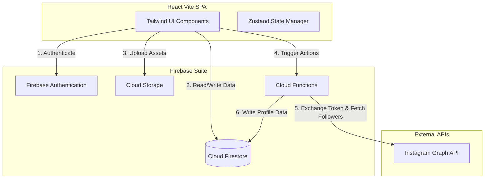

# Production Readiness Plan - Kreator Kolkata

This document details the architectural requirements, database designs, API integrations, and code enhancements needed to transition this demo interface into a production-grade hyperlocal creator collaboration platform.

---

## 1. Firebase Integration Architecture

To handle data persistence, authentication, and asset storage, we will transition the app's local mock state to Firebase.



### A. Authentication Setup
- **Authentication Providers**:
  - Phone Auth (OTP): Crucial for local verification in India/Kolkata.
  - Email & Password: Standard backup.
  - Federated Login: Facebook Login (specifically required for Instagram Business API access).
- **Session Management**: Persistent tokens via Firebase SDK with automatic session recovery.

### B. Cloud Firestore Database Schema

#### `users` Collection (Creators & Brands)
```json
{
  "uid": "USER_AUTH_UID",
  "role": "creator" | "brand",
  "email": "priya.creates@gmail.com",
  "name": "Priya Sengupta",
  "location": "Kolkata, West Bengal",
  "joinedAt": "2026-08-02T13:30:00Z",
  "verified": true,
  "rating": 4.9,
  "avatarUrl": "https://firebasestorage.googleapis.com/.../avatar.jpg",
  "bannerUrl": "https://firebasestorage.googleapis.com/.../banner.jpg",
  
  // Creator-specific fields
  "creatorDetails": {
    "handle": "@priya.creates",
    "niche": "Lifestyle & Fashion",
    "bio": "Creating real, aesthetic content...",
    "instagramConnected": true,
    "instagramDetails": {
      "username": "priya.creates",
      "followers": 124000,
      "mediaCount": 85,
      "lastSynced": "2026-08-02T12:00:00Z"
    },
    "portfolio": [
      { "id": 1, "url": "https://...", "likes": 320 }
    ]
  },
  
  // Brand-specific fields
  "brandDetails": {
    "industry": "Ethnic Fashion",
    "bio": "Celebrating the vibrant heritage of Indian textiles...",
    "website": "www.rangbahar.com"
  }
}
```

#### `gigs` Collection (Campaigns)
```json
{
  "gigId": "GIG_DOCUMENT_ID",
  "title": "Brand Collab for Ethnic Fashion Launch",
  "type": "Paid" | "Barter" | "Collab",
  "budget": "₹8,000 – ₹15,000",
  "tags": ["Fashion", "Reel", "Story"],
  "location": "Kolkata, WB",
  "description": "...",
  "deliverables": ["2 Instagram Reels", "3 Stories"],
  "deadline": "2026-08-20T23:59:59Z",
  "postedBy": "BRAND_USER_UID",
  "brandName": "Rang Bahar Textiles",
  "brandLogo": "https://...",
  "status": "Active" | "Completed" | "Draft",
  "createdAt": "2026-08-01T10:00:00Z",
  "applicantCount": 12
}
```

#### `applications` Collection (Gigs Applied)
```json
{
  "applicationId": "APP_ID",
  "gigId": "GIG_DOCUMENT_ID",
  "creatorId": "CREATOR_USER_UID",
  "brandId": "BRAND_USER_UID",
  "pitch": "I would love to style the new collections...",
  "status": "Pending" | "Reviewed" | "Accepted" | "Declined",
  "createdAt": "2026-08-02T11:00:00Z"
}
```

#### `chats` Collection (Messaging)
- **`threads`**: Stores metadata like `lastMessage`, `participants` array, and `unreadCounts`.
- **`messages`**: Sub-collection in each thread storing `text`, `senderId`, `timestamp`, and `type` (text, image, gig_pitch).

### C. Cloud Storage Configuration
- Folders: `/avatars`, `/banners`, `/portfolio`, `/chat_media`.
- Rules: Enforce read accessibility for public profiles, write access restricted to the owning `uid`.

---

## 2. Secure Instagram API Integration

To obtain accurate, verified follower statistics and content insights, the platform must connect to Instagram via Facebook OAuth.

> [!CAUTION]
> **API Limitation Alert**:
> The *Instagram Basic Display API* **does not** return follower counts. 
> To fetch follower counts, we must use the **Instagram Graph API**. This requires:
> 1. The user must have an **Instagram Business** or **Instagram Creator** account.
> 2. The account must be connected to a **Facebook Page** owned by the user.

### Secure Auth & Integration Flow
1. **Trigger Connect**: The creator clicks "Connect Instagram (secure way)" on their profile page.
2. **Redirect to Meta**: The app redirects the user to Facebook Login with scopes:
   `instagram_basic`, `instagram_manage_insights`, `pages_show_list`, `pages_read_engagement`.
3. **Facebook Callback**: Facebook redirects the user back to the webapp with an authorization code.
4. **Cloud Function Exchange**: The code is sent to a secure Firebase Cloud Function.
   - The Cloud Function makes a backend POST request with the `App Secret` (never exposed to client) to Facebook OAuth to retrieve a **long-lived access token** (valid for 60 days).
5. **Fetch & Save Metrics**:
   - The Cloud Function queries the user's Facebook pages to find the linked Instagram account.
   - Queries `GET /v19.0/{instagram-business-account-id}?fields=followers_count,media_count,username`.
   - Saves the metrics directly into the creator's Firestore document.
   - Schedules a daily Firebase Cron Job (Pub/Sub) to refresh follower counts and insights without user interaction.

---

## 3. General Development Requirements for Production

### A. Frontend Enhancements (UI/UX)
- **Instagram Connect Button**:
  - Render `Connect Instagram (secure way)` inside parenthesis if `instagramConnected` is false.
  - Show a clear warning modal explaining the security protocols and that we only read public metrics (followers, username), keeping their account safe.
- **State Management**:
  - Migrate from component-level prop-drilling to **Zustand** or **Redux Toolkit** for unified state (chats, active user session, gigs feed).
- **Error Boundaries & Offline Handling**:
  - Implement full-screen loading skeleton screens for Gigs feeds and Profile pages.
  - Implement offline storage caching via Firestore persistence (`enableIndexedDbPersistence()`).

### B. Security & Optimization
- **Firestore Security Rules**: Strict rules validating matching request uids for editing profiles and messages.
- **Environment Variables**: Move API keys, domain config, and appId variables into a `.env.production` file.
- **Optimization**: Compress uploaded profile/portfolio pictures on the fly using Cloud Functions and Sharp.
